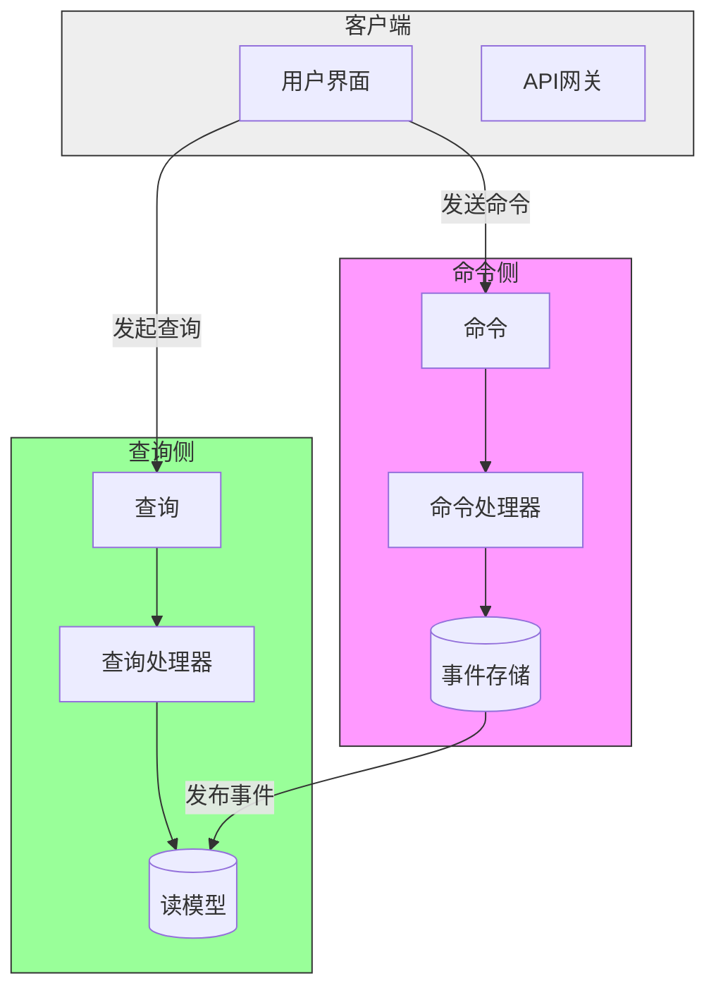

# CQRS架构指南

## 什么是CQRS

CQRS(Command Query Responsibility Segregation)是一种将读写操作分离的架构模式。

## 核心概念

- **命令(Command)**：改变系统状态的操作
- **查询(Query)**：获取系统状态的操作
- **命令模型**：处理命令的模型
- **查询模型**：处理查询的模型

## CQRS架构图示



## 适用场景

- 读写负载差异大的系统
- 需要高性能查询的系统
- 复杂业务逻辑的系统

## 实现示例

```java
// 命令接口
public interface Command<T> {
    T execute();
}

// 命令处理器
public class CommandHandler<T> {
    public void handle(Command<T> command) {
        command.execute();
    }
}

// 命令实现
public class CreateUserCommand implements Command<User> {
    private User user;
    public CreateUserCommand(User user) {
        this.user = user;
    }
}

// 命令处理器实现
public class CreateUserCommandHandler extends CommandHandler<CreateUserCommand> {
    // 注入领域服务
    @Autowired
    private UserDomainService userDomainService;

    @Override
    public void handle(CreateUserCommand command) {
        userDomainService.createUser(command.getUser());
    }
}

// 查询接口
public interface Query<T> {
    T execute();
}

// 查询处理器
public class QueryHandler<T> {
    public T handle(Query<T> query) {
        return query.execute();
    }
}
// 查询实现
public class GetUserQuery implements Query<User> {
    private Long id;
    public GetUserQuery(Long id) {
        this.id = id;
    }
}

// 查询处理器实现
public class GetUserQueryHandler extends QueryHandler<GetUserQuery> {
    // 注入领域服务
    @Autowired
    private UserDomainService userDomainService;
    @Override
    public User handle(GetUserQuery query) {
        return userDomainService.getUser(query.getId());
    }
}
```