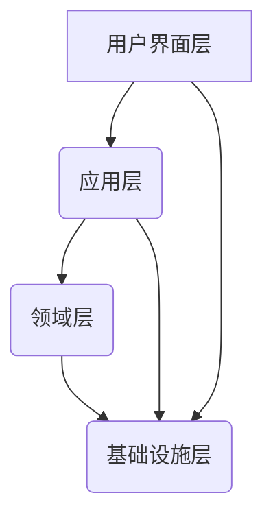

## 前言
我在学习DDD的过程中，感觉最难的就是落地，也曾研究过很多的关于DDD的实现框架，但是最终，觉得不适合初学者用来学习，因为这些框架会有几个问题：

    1. 框架的设计过于复杂，难以理解
    2. 语言不是自己想要的，可能用的.Net 可能用的Kotlin
    3. 没有详细的文档，导致学习成本过高，如果需要详细的文档，需要付费。

基于以上的原因，我决定自己写一个DDD的框架，这个框架的设计是非常简单的，但是可以帮助初学者理解DDD的思想，并且可以帮助初学者快速的实现DDD的框架。

## DDD领域驱动设计四层架构

### 各层说明
1. **用户界面层**：
   - 负责展示信息和接收用户指令
   - 包含Web界面、移动端、API接口等

2. **应用层**：
   - 协调领域对象完成业务用例
   - 不包含业务逻辑，只负责流程控制

3. **领域层**：
   - 核心业务逻辑所在
   - 包含实体、值对象、聚合根、领域服务等

4. **基础设施层**：
   - 提供技术实现支持
   - 包含数据库访问、消息队列、缓存等

   基于以上的四层架构，进行了Nebula Framework的设计。

