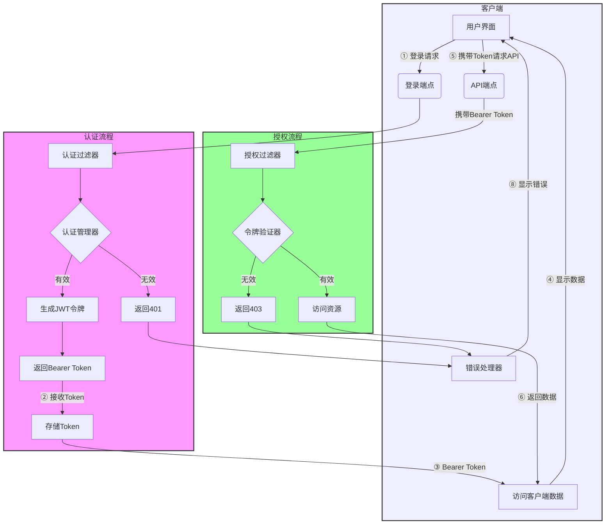

# 认证授权

本框架采用的是基于`Spring Security`的认证授权框架，具体的实现方式可以参考`nebula-framework-auth`模块的`security`目录。

## 认证授权流程
1. 用户登录
2. 认证授权（使用Bearer Token）
3. 访问资源

```mermaid
graph TD
    subgraph 客户端
        A[用户界面] -->|① 登录请求| B
        H -->|④ 显示数据| A
        A -->|⑤ 携带Token请求API| I
        L -->|⑧ 显示错误| A
    end

    subgraph 认证流程
        B(登录端点) --> C[认证过滤器]
        C --> D{认证管理器}
        D -->|有效| E[生成JWT令牌]
        E --> F[返回Bearer Token]
        F -->|② 接收Token| G[存储Token]
        G -->|③ Bearer Token| H[访问客户端数据]
        D -->|无效| M[返回401]
        M --> L[错误处理器]
    end

    subgraph 授权流程
        I(API端点) -->|携带Bearer Token| J[授权过滤器]
        J --> K{令牌验证器}
        K -->|有效| N[访问资源]
        N -->|⑥ 返回数据| H
        K -->|无效| O[返回403]
        O --> L
    end

    style 认证流程 fill:#f9f,stroke:#333,stroke-width:2px
    style 授权流程 fill:#9f9,stroke:#333,stroke-width:2px
    style 客户端 fill:#eef,stroke:#333,stroke-width:2px
```

