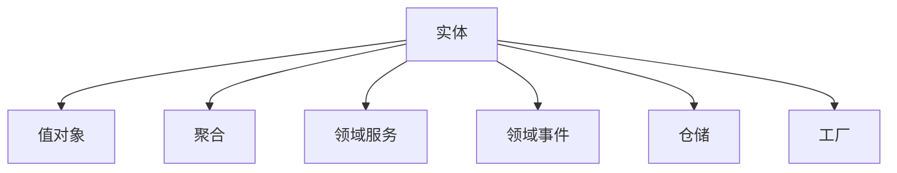

# 战术设计（Tactical Design）{#tactical-design}

战术设计是领域驱动设计中处理领域模型内部细节的微观设计方法，它关注如何实现业务逻辑的具体技术细节。

## 通俗理解
战术设计就像建筑内部设计：
- 房间功能布局（客厅、卧室、厨房）
- 家具摆放和装饰细节
- 水电管线等基础设施

## 核心模式

## 主要组件
1. **实体**：具有唯一标识的领域对象
2. **值对象**：通过属性定义的对象
3. **聚合**：一组相关对象的集合
4. **领域服务**：跨聚合的业务逻辑
5. **领域事件**：业务状态变化的记录
6. **仓储**：持久化接口
7. **工厂**：复杂对象的创建逻辑

## 设计原则
1. **高内聚**：相关逻辑放在一起
2. **低耦合**：减少组件间依赖
3. **显式表达**：代码清晰表达业务意图
4. **可测试性**：便于单元测试和验证

## 实施步骤
1. 识别领域模型中的关键概念
2. 定义实体和值对象
3. 划分聚合边界
4. 设计领域服务和事件
5. 实现仓储和工厂