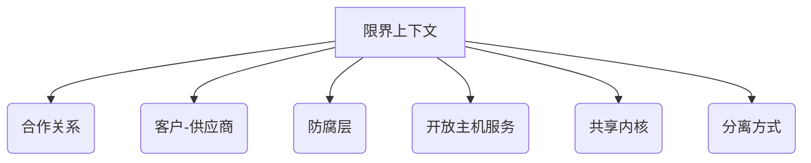

# 战略设计（Strategic Design）{#strategic-design}

战略设计是领域驱动设计中处理复杂业务系统的宏观设计方法，它关注如何划分和组织大型系统的各个部分。

## 通俗理解
战略设计就像城市规划：
- 划分城市功能区（商业区、住宅区、工业区）
- 设计交通网络连接各个区域
- 制定城市发展蓝图

## 核心概念
1. **限界上下文**：定义清晰的业务边界
2. **上下文映射**：明确不同上下文间的关系
3. **通用语言**：统一业务与技术术语
4. **核心子域**：识别最具业务价值的领域

## 主要模式

## 实施步骤
1. **领域分析**：识别业务能力和痛点
2. **上下文划分**：定义业务边界
3. **关系建模**：确定上下文间交互方式
4. **架构设计**：选择合适的技术实现

## 设计原则
1. **业务优先**：设计服务于业务目标
2. **渐进式**：从核心领域开始逐步扩展
3. **持续演进**：随着业务变化调整设计
4. **团队对齐**：组织结构匹配领域划分